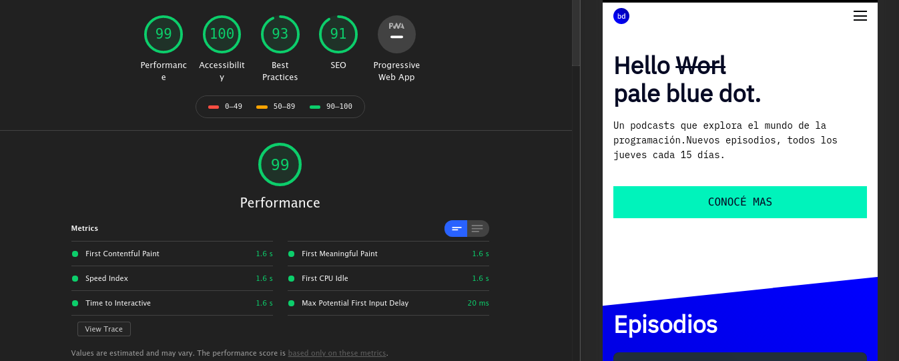

# Buenas Practicas : 

Se llevaron a cabo  practicas para mejorar accesibilidad, SEO y Performance : 

### Accesibilidad : 

A cada una de las imagenes del sitio se le agregaron los atributos : 

- alt: Aqui se incorporo una descripcion o nombre de la imagen.

- loadiin: Este atributo permite que cada img del sitio se  cargue si estamos en una porcion del sitio que hay img, es decir cuando se hace el get a la url , no se cargan automaticamente todas las imagenes del sitio sino las que se necesitan mostrar.
Para que esto funcione el valor del atributo debe ser lazy.

    ```html
            
            
            
    ```

- rel y aria-label : Estos son atributos para las etiquetas 'a'. El primero entra en funcionamiento al momento de ejecutar el _target y el segundo permite describir hacia donde va el redirecionamiento.
    ```html
         <a href="https://www.spotify.com/ar/" target="_blank" rel="noreferrer" aria-label="Ir Spotify"   ><i class="fab fa-spotify" id="spotify"></i></a>
            <a href="https://www.instagram.com/" target="_blank" rel="noreferrer" aria-label="Ir a Instagram" ><i class="fab fa-instagram" id="instagram"></i></a>
    ```
- title : Este atributo se incorporo a los iframe de Spotify. Permite describir el mismo ayudando a los lectores de pantalla.
    ```html
          <iframe class="iframe" src="https://open.spotify.com/embed-podcast/episode/7AZZy2nJ4R9ZndHW0h2yxt"
                allow="encrypted-media" title="JS-PARTY"  ></iframe>
            <iframe class="iframe" src="https://open.spotify.com/embed-podcast/episode/1ezdL2ivAGLwSE6Xbssxqt"
                allow="encrypted-media" title="WEB-DEVELOPMENT"  ></iframe>
    ```

### Performance :
Sumando la ventaja de  "loading - lazy", se comprimieron las img usando una herramienta web llamada  
<a href="https://tinypng.com/">Tiny Png</a>.Se optimizaron en casi un 70% las imagenes.

### Auditoria : 

- Mobile
      

- Desktop : 
    